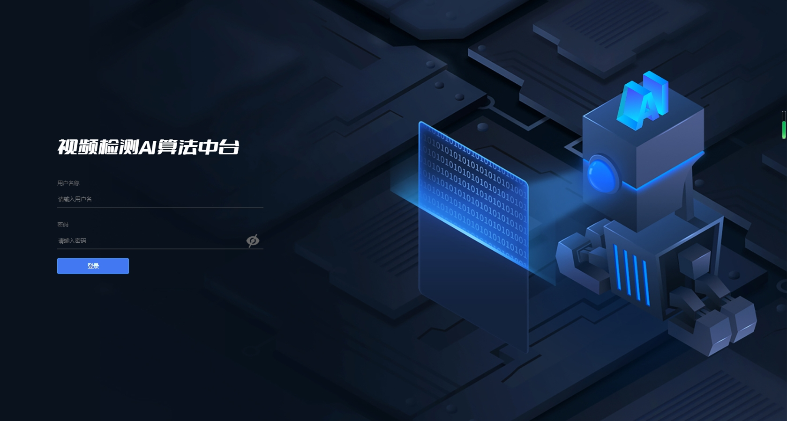
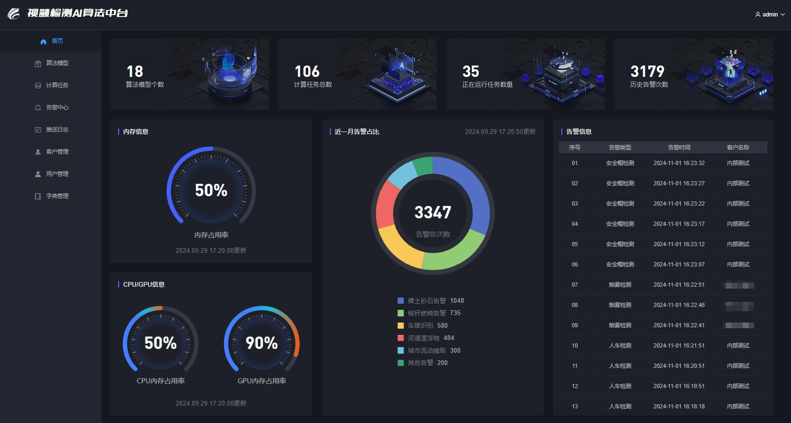
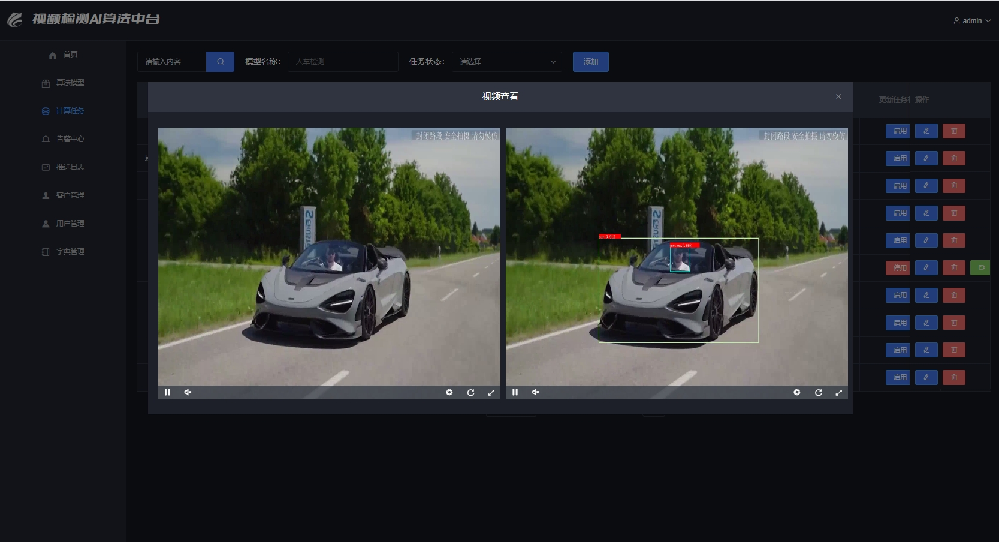
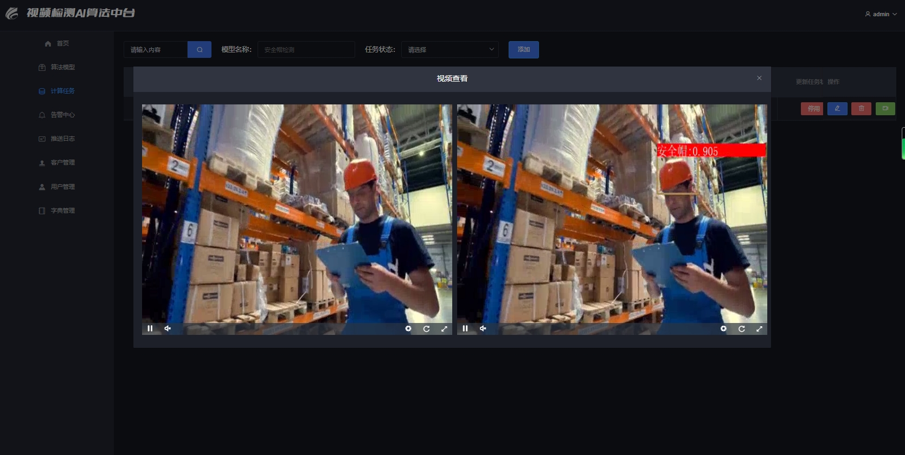

# AI Vision Intelligence Platform
## 企业级视频算法中台系统

[](LICENSE)
[](https://www.oracle.com/java/)
[](https://spring.io/projects/spring-boot)
[](https://www.docker.com/)
[](https://developer.nvidia.com/cuda-toolkit)

### ▶️ 项目概述

AI Vision Intelligence Platform 是一个基于现代微服务架构的企业级视频智能分析中台系统。该平台整合了深度学习、计算机视觉、流媒体处理等前沿技术，为企业提供高性能、可扩展的视频AI解决方案。

### ◆ 核心特性

- **◉ 多场景AI识别**: 支持人员、车辆、火灾烟雾、河道漂浮物、道路裂痕等多种目标检测
- **◈ 高性能推理**: 基于NVIDIA TensorRT的GPU加速推理，支持实时视频处理
- **◎ 双引擎支持**: 同时支持ONNX和TensorRT推理引擎，灵活切换
- **▣ 实时流媒体**: 集成FFmpeg和ZLMediaKit，支持多协议视频流处理
- **▦ 跨平台部署**: 支持Linux和Windows环境，容器化部署
- **▧ 智能告警**: 实时告警推送和数据分析
- **▨ 开箱即用**: 完整的前后端代码，快速部署上线

### ▲ 技术优势

- **混合语言架构**: Java后端 + Python AI推理 + Vue前端，发挥各语言优势
- **企业级性能**: 基于NVIDIA Tesla T4优化，支持高并发视频处理
- **云原生设计**: Docker容器化部署，支持Kubernetes编排
- **实时数据流**: 集成RocketMQ消息队列和MinIO对象存储
- **可视化管理**: 直观的Web管理界面，支持模型管理和任务调度

## ▣ 系统架构

### 架构设计理念

本平台采用分层解耦的微服务架构，充分发挥不同技术栈的优势：
- **Java生态**: 利用Spring Boot构建稳定可靠的Web服务层
- **Python AI**: 发挥Python在机器学习领域的生态优势
- **容器化**: Docker容器化部署，提升运维效率和系统可移植性


### ▦ 技术栈

#### 核心框架
| 层级 | 技术选型 | 版本 | 说明 |
|------|----------|------|------|
| **前端** | Vue.js + Node.js | 3.x | 现代化响应式Web界面 |
| **后端** | Spring Boot | 2.7+ | 企业级Java Web框架 |
| **数据层** | MyBatis | 3.x | 灵活的ORM框架 |
| **AI引擎** | Python + Shell | 3.8+ | 跨平台AI推理执行 |

#### 基础设施
| 组件 | 技术选型 | 版本 | 用途 |
|------|----------|------|------|
| **数据库** | MySQL + Redis + MongoDB | 8.0+ / 6.x / 4.x | 关系型+缓存+文档数据库 |
| **消息队列** | Apache RocketMQ | 4.9+ | 异步消息处理 |
| **对象存储** | MinIO | Latest | 分布式文件存储 |
| **流媒体** | ZLMediaKit + FFmpeg | Latest / 4.2.7 | 视频流处理 |
| **容器化** | Docker + Ubuntu | 20.10+ / 20.04 | 容器化部署 |

#### AI计算栈
| 组件 | 版本 | 说明 |
|------|------|------|
| **CUDA** | 11.8 | NVIDIA GPU计算平台 |
| **cuDNN** | 8.6.0 | 深度学习加速库 |
| **TensorRT** | 8.5.1.7 | 高性能推理优化 |
| **PyTorch** | 2.3.0 | 深度学习框架 |
| **ONNX Runtime** | 1.16.1 | 跨平台推理引擎 |
| **YOLOv8** | Ultralytics 8.2.48 | 目标检测模型 |
| **OpenCV** | 4.7.0 | 计算机视觉库 |

#### 硬件规格
- **CPU**: Intel Xeon Gold 5218 @ 2.30GHz
- **GPU**: NVIDIA Tesla T4 16GB
- **推荐内存**: 32GB+
- **存储**: SSD 500GB+


## ▤ 项目结构

```
ai-middle-platform/
├── ▣ data/
│   ├── ▧ algorithm_model/     # AI模型库 (.pt/.onnx/.engine)
│   ├── ▦ doc/                 # API接口文档
│   ├── ▨ front_code/          # Vue.js前端源码
│   ├── ▩ linux/               # Linux推理脚本
│   ├── ▪ windows/             # Windows推理脚本
│   └── ▫ sql/                 # 数据库脚本
├── ▣ src/                     # Spring Boot后端源码
├── ▣ img/                     # 项目截图和演示
├── ▬ Dockerfile              # 容器化配置
├── ▭ pom.xml                 # Maven依赖配置
└── ▮ README.md               # 项目文档
```

### 核心模块说明

| 模块 | 功能描述 | 技术实现 |
|------|----------|----------|
| **算法模型库** | 预训练模型存储，支持多格式 | PyTorch → ONNX → TensorRT |
| **推理引擎** | 跨平台AI推理执行 | Python + CUDA + TensorRT |
| **流媒体处理** | 视频流接入和推送 | FFmpeg + ZLMediaKit |
| **Web管理界面** | 模型管理和任务调度 | Vue.js + Element UI |
| **API服务** | RESTful接口服务 | Spring Boot + MyBatis |


## ▶️ 快速开始

### 环境要求

- **操作系统**: Ubuntu 20.04+ / Windows 10+
- **Java**: JDK 1.8+
- **Python**: 3.8+
- **Docker**: 20.10+
- **GPU**: NVIDIA显卡 (推荐Tesla T4/V100/A100)

### ▣ 一键部署

#### 1. 流媒体服务部署

```bash
# 拉取ZLMediaKit镜像
docker pull zlmediakit/zlmediakit:master

# 创建数据目录
mkdir -p /home/docker/zlmediakit && chmod 777 /home/docker/zlmediakit

# 初始化配置
docker run --name zlmediakit -d zlmediakit/zlmediakit:master
docker cp -a zlmediakit:/opt/media /home/docker/zlmediakit
docker rm -f zlmediakit

# 启动流媒体服务
docker run --name zlmediakit --restart=always \
    --env MODE=standalone -e TZ="Asia/Shanghai" \
    -v /home/docker/zlmediakit/media/bin:/opt/media/bin \
    -v /home/docker/zlmediakit/media/conf:/opt/media/conf \
    -p 11935:1935 -p 11080:80 -p 11554:554 \
    -p 11000:10000 -p 11000:10000/udp -p 18000:8000/udp \
    -p 50000-50300:50000-50300/udp \
    -d zlmediakit/zlmediakit:master
```

#### 2. 基础服务部署

使用Docker Compose一键部署所有基础服务：

```bash
# 克隆项目
git clone https://github.com/xiaoyeshenger/java_pytorch_onnx_tensorrt_yolov8_vue.git
cd java_pytorch_onnx_tensorrt_yolov8_vue

# 启动基础服务
docker-compose up -d mysql redis mongodb rocketmq minio

# 导入数据库
mysql -h localhost -P 3306 -u root -p < data/sql/algorithm_center.sql
```


4.安装推理环境并运行后端项目

  (1).在Windows下安装推理环境并运行(根据自己计算机的硬件配置情况选择如下3种安装方式中的1种)

      **1**.安装推理环境

        1).计算机没有GPU显卡---使用onnxruntime的cpu版本进行推理
        --1.电脑主机需要安装如下软件
            ①.Anaconda3(安装方法百度: Windows安装anaconda3 或参考 https://blog.csdn.net/zwLoneranger/article/details/138743242)
            ②.opencv4.7.0 (安装方法百度: Windows安装opencv)
            ③.FFmpeg4.2.7 (安装方法百度: Windows安装FFmpeg)

        --2.由于推理代码是使用python语言运行,所以需要在Python环境(如Python3.9/Anaconda3/Miniconda)中安装如下依赖库:
            ①.opencv-python4.9.0.80 (安装方法: pip install opencv-python==4.9.0.80 -i https://pypi.tuna.tsinghua.edu.cn/simple/)
            ②.torch2.0.1 + torchvision0.15.2 + torchaudio2.0.2 (安装方法: pip install torch==2.0.1 torchvision==0.15.2 torchaudio==2.0.2 --index-url https://download.pytorch.org/whl/cu118)
            ③.yolov8 ultralytics (安装方法: pip install ultralytics==8.2.48 -i https://pypi.tuna.tsinghua.edu.cn/simple/)
            ④.Onnxruntime-cpu1.16.1 (运行.onnx模型文件需要该依赖，此处安装cpu版本。安装方法: pip install onnxruntime-cpu==1.16.1 -i https://pypi.tuna.tsinghua.edu.cn/simple/)
        

        2).计算机有GPU显卡---使用onnxruntime的gpu版本进行推理
        --1.电脑主机需要安装如下软件
            ①.Anaconda3(安装方法百度: Windows安装anaconda3 或参考 https://blog.csdn.net/zwLoneranger/article/details/138743242)
            ②.opencv4.7.0 (安装方法百度: Windows安装opencv)
            ③.FFmpeg4.2.7 (安装方法百度: Windows安装FFmpeg)
            ④.Cuda11.8 (安装方法百度: Windows安装Cuda)
            ⑤.Cudnn8.6.0 (安装方法百度: Windows安装Cudnn)

        --2.由于推理代码是使用python语言运行,所以需要在Python环境(如Python3.9/Anaconda3/Miniconda)中安装如下依赖库:
            ①.opencv-python4.9.0.80 (安装方法: pip install opencv-python==4.9.0.80 -i https://pypi.tuna.tsinghua.edu.cn/simple/)
            ②.torch2.0.1 + torchvision0.15.2 + torchaudio2.0.2 (安装方法: pip install torch==2.0.1 torchvision==0.15.2 torchaudio==2.0.2 --index-url https://download.pytorch.org/whl/cu118)
            ③.yolov8 ultralytics (安装方法: pip install ultralytics==8.2.48 -i https://pypi.tuna.tsinghua.edu.cn/simple/)
            ④.Onnxruntime-gpu1.16.1 (运行.onnx模型文件需要该依赖，此处安装gpu版本。安装方法: pip install onnxruntime-gpu==1.16.1 -i https://pypi.tuna.tsinghua.edu.cn/simple/)
        

        3).计算机有GPU显卡,并且是Nvidia的显卡---使用Nvidia的Tensorrt进行推理加速(速度大于onnx推理,是目前推理速度最快的方式)
        --1.电脑主机需要安装如下软件
            ①.Anaconda3(安装方法百度: Windows安装anaconda3 或参考 https://blog.csdn.net/zwLoneranger/article/details/138743242)
            ②.opencv4.7.0 (安装方法百度: Windows安装opencv)
            ③.FFmpeg4.2.7 (安装方法百度: Windows安装FFmpeg)
            ④.Cuda11.8 (安装方法百度: Windows安装Cuda)
            ⑤.Cudnn8.6.0 (安装方法百度: Windows安装Cudnn)
            ⑥.Tensorrt8.5.1.7 (运行.engine模型文件需要该依赖。安装方法百度: Windows安装Tensorrt)

        --2.由于推理代码是使用python语言运行,所以需要在Python环境(如Python3.9/Anaconda3/Miniconda)中安装如下依赖库:
            ①.opencv-python4.9.0.80 (安装方法: pip install opencv-python==4.9.0.80 -i https://pypi.tuna.tsinghua.edu.cn/simple/)
            ②.torch2.0.1 + torchvision0.15.2 + torchaudio2.0.2 (安装方法: pip install torch==2.0.1 torchvision==0.15.2 torchaudio==2.0.2 --index-url https://download.pytorch.org/whl/cu118)
            ③.yolov8 ultralytics (安装方法: pip install ultralytics==8.2.48 -i https://pypi.tuna.tsinghua.edu.cn/simple/)
            ④.Onnxruntime-gpu1.16.1 (运行.onnx模型文件需要该依赖，此处安装gpu版本。安装方法: pip install onnxruntime-gpu==1.16.1 -i https://pypi.tuna.tsinghua.edu.cn/simple/)


      **2**.本地IDEA中启动后端项目

        --1.修改mysql、mongoDB、redis、rocketmq、minio的连接地址
      
        --2.运行 AlgorithmCenterApplication.main(String[] args)以启动项目

    

  (2).在Linux的Docker容器中安装推理环境并运行

      1).在服务器新建3个目录比如 /home/docker/ai/py_java/algcenter  /home/docker/ai/py_java/nvidia  /home/docker/ai/py_java/opencv


      2).拷贝docker运行的所需文件到服务器
         --1.将data/algcenter/下的所有内容拷贝到/home/docker/ai/py_java/algcenter/目录，algcenter下的内容为项目jar包(jar需要执行 mvn clean intsall打包放入algcenter)和项目的配置文件

         --2.下载英伟达(NVIDIA)相关的文件并保存到/home/docker/ai/py_java/nvidia/ 目录
             ①.下载cuda_11.8,下载命令 wget https://developer.download.nvidia.com/compute/cuda/11.8.0/local_installers/cuda_11.8.0_520.61.05_linux.run

             ②.下载cuDNN8.6.0.163,下载地址 https://developer.nvidia.com/rdp/cudnn-archive#a-collapse897-118

             ③.下载tensorRT 8.5.1.17,下载地址 https://developer.nvidia.com/tensorrt
 
         --3.下载opencv4.7.0并保存到/home/docker/ai/py_java/opencv/目录,下载地址 https://opencv.org/releases/

         --4.构建docker镜像
             ①.将data/docker/Dockerfile 拷贝到服务器 /home/docker/ai/py_java/
             
             ②.进入到/home/docker/ai/py_java/目录，执行 docker build -t py_java_ai:1.0 . 命令以构建镜像

             ③.该镜像包含ubuntu20.04、jdk11、python3.8、pip、opencv、cuda11.8、cudnn8.6.0、TensorRT8.5.1.7、onnxruntime-gpu==1.16.1、pytorch2.3.0、ultralytics8.2.48


       3).镜像构建完成后，执行docker run 命令以便运行algcenter
          docker run --name=algcenter --restart=always --privileged=true \
                     --gpus all \
                     -p 8088:8088 \
                     -v /home/docker/ai/py_java/algcenter/:/data/app \ 
                     -v /home/docker/ai/py_java/algcenter/config:/config \
                     -v /etc/localtime:/etc/localtime \
                     -d py_java_ai:1.0 /data/app/run.sh


5.运行前端项目 

  (1).本地VSCODE中运行：

      1).安装依赖 npm install
      
      2).修改服务器的访问地址

      3).启动项目 npm run dev
     
      4).访问地址 http://ip:8080/login  用户名/密码: admin / 123456


  (2).服务器Nginx中运行:

      1).nginx的安装

         --1.在服务器新建目录 /home/docker/ai/nginx/

         --2.将data/nginx/下的所有文件拷贝到服务器 /home/docker/ai/nginx/目录下
         
         --3.执行docker run 命令以便运行nginx
            docker run --name=nginx --restart=always  --privileged=true \
                    -p 8080:80 -p 1935:1935 \
                    -v /home/docker/ai/nginx/data:/usr/share/nginx/html/ \
                    -v /home/docker/ai/nginx/config/nginx.conf:/etc/nginx/nginx.conf \
                    -v /home/docker/ai/nginx/config/conf.d/default.conf:/etc/nginx/conf.d/default.conf\
                    -v /home/docker/ai/nginx/logs:/var/log/nginx/ \
                    -v /home/docker/ai/nginx/ssl:/ssl/ \
                    -d tiangolo/nginx:latest 

      2).打包项目 npm build
      
      3).将打包后新生成的dist文件夹拷贝到Nginx的/home/docker/ai/nginx/data/目录

      4).访问地址 http://ip:8080/login  用户名/密码: admin / 123456


## ▦ 使用指南

### ▧ 管理界面

访问 `http://your-server:8080/login` 
- **默认账号**: admin / 123456

#### 核心功能模块

| 模块 | 功能 | 说明 |
|------|------|------|
| ▧ **算法模型** | 模型生命周期管理 | 上传、配置、版本管理 |
| ▨ **计算任务** | 推理任务调度 | 创建、启动、监控任务 |
| ▩ **告警中心** | 智能告警管理 | 实时告警、历史记录 |
| ▪ **推送日志** | 数据推送监控 | HTTP推送日志追踪 |
| ▫ **客户管理** | 客户端配置 | 告警推送目标管理 |

### ▬ API集成

详细的API文档请参考：`data/doc/算法中台接口文档(v2.0).docx`

#### 核心API端点

```bash
# 模型管理
POST /api/v1/models          # 上传模型
GET  /api/v1/models          # 获取模型列表
PUT  /api/v1/models/{id}     # 更新模型

# 任务管理  
POST /api/v1/tasks           # 创建任务
GET  /api/v1/tasks           # 获取任务列表
PUT  /api/v1/tasks/{id}/start # 启动任务

# 告警查询
GET  /api/v1/alarms          # 获取告警列表
POST /api/v1/alarms/webhook  # 告警回调
```

### ▭ AI模型训练

#### YOLOv8模型训练流程

```python
# 1. 环境准备
pip install ultralytics torch torchvision

# 2. 数据准备
from ultralytics import YOLO
import yaml

# 创建数据配置文件
data_config = {
    'train': 'path/to/train/images',
    'val': 'path/to/val/images', 
    'test': 'path/to/test/images',
    'nc': 80,  # 类别数量
    'names': ['person', 'car', 'fire', ...]  # 类别名称
}

# 3. 模型训练
model = YOLO('yolov8n.pt')  # 加载预训练模型
results = model.train(
    data='data.yaml',
    epochs=100,
    imgsz=640,
    batch=16,
    device=0  # GPU设备
)

# 4. 模型评估
metrics = model.val()
print(f"mAP50: {metrics.box.map50}")
print(f"mAP50-95: {metrics.box.map}")
```

#### 关键性能指标

| 指标 | 说明 | 目标值 |
|------|------|--------|
| **Precision** | 精确率 | > 0.85 |
| **Recall** | 召回率 | > 0.80 |
| **mAP50** | 平均精度@IoU=0.5 | > 0.75 |
| **mAP50-95** | 平均精度@IoU=0.5:0.95 | > 0.45 |
| **FPS** | 推理速度 | > 30 |

### ▮ 模型部署

#### 模型格式转换流程

```bash
# 1. PyTorch → ONNX
python3 export-det.py \
    --weights best.pt \
    --iou-thres 0.65 \
    --conf-thres 0.25 \
    --topk 100 \
    --opset 11 \
    --sim \
    --input-shape 1 3 640 640

# 2. ONNX → TensorRT Engine
trtexec \
    --onnx=best.onnx \
    --saveEngine=best.engine \
    --fp16 \
    --workspace=4096
```

#### 部署配置

| 参数 | 说明 | 推荐值 |
|------|------|--------|
| **modelKey** | 模型标识符 | best |
| **shellKey** | 推理脚本 | yolov8 |
| **confidence** | 置信度阈值 | 0.25 |
| **iou_threshold** | NMS阈值 | 0.65 |
| **input_size** | 输入尺寸 | 640x640 |

#### 支持的视频格式

- **实时流**: RTSP, RTMP, WebRTC
- **点播流**: HLS, DASH, FLV
- **本地文件**: MP4, AVI, MOV, MKV
- **网络协议**: HTTP, WebSocket

#### 部署步骤

1. **模型上传**: 通过Web界面上传转换后的模型文件
2. **任务配置**: 设置视频源和推理参数  
3. **启动推理**: 一键启动实时推理任务
4. **结果查看**: 实时查看原始视频和推理结果


## ▰ 效果展示

### 系统界面

<div align="center">

#### 登录界面


#### 主控台


#### 告警中心


</div>

### AI识别效果

<div align="center">

| 场景 | 识别效果 | 应用领域 |
|------|----------|----------|
| **车辆检测** |  | 交通监控、停车管理 |
| **火灾检测** |  | 安全监控、消防预警 |
| **安全帽检测** |  | 工地安全、合规检查 |

</div>

### 性能指标

| 指标 | 数值 | 说明 |
|------|------|------|
| **推理速度** | 30+ FPS | Tesla T4 GPU |
| **检测精度** | mAP50 > 85% | YOLOv8模型 |
| **延迟** | < 100ms | 端到端延迟 |
| **并发数** | 16+ 路 | 同时处理视频流 |

## ▱ 贡献者

感谢所有为项目做出贡献的开发者：

<div align="center">

| 贡献者 | 角色 | 主要贡献 |
|--------|------|----------|
| **黑白条纹** | 核心开发者 | 架构设计、后端开发 |
| **QinJ5** | AI算法工程师 | 模型优化、推理加速 |
| **Zoe** | 前端工程师 | UI设计、前端开发 |

</div>

特别感谢 **骄姐** 与 **Zoe** 的鼎力支持！

## ▲ 相关项目

### 开源生态

- [Java-ONNX-YOLO](https://toscode.mulanos.cn/agricultureiot/yolo-onnx-java) - 常康的Java ONNX推理实现
- [JavaVision](https://gitee.com/giteeClass/java-vision) - xgc的Java计算机视觉库

### 技术栈参考

- [Ultralytics YOLOv8](https://github.com/ultralytics/ultralytics) - 官方YOLOv8实现
- [ZLMediaKit](https://github.com/ZLMediaKit/ZLMediaKit) - 流媒体服务器
- [TensorRT](https://developer.nvidia.com/tensorrt) - NVIDIA推理加速库


</div>

---

<div align="center">

**如果这个项目对你有帮助，请给个 ◆ Star 支持一下！**

Made with ◇ by AI Vision Team

</div>
